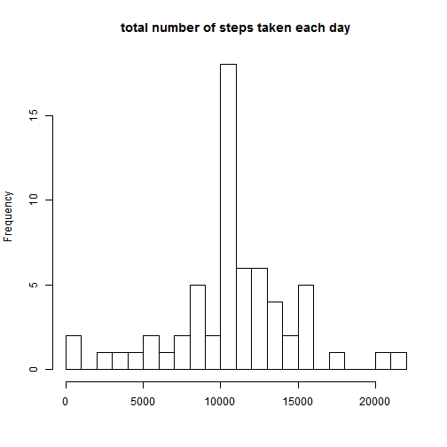

# Peer Assessment 1

## Loading and preprocessing the data

First, we read and transform the data into a suitable format for our analysis


```r
DATA <- read.csv("activity.csv", stringsAsFactors = FALSE)
DATA$date <- as.Date(DATA$date, "%Y-%m-%d")
DATA$steps <- as.numeric(DATA$steps)
```

## Finding the mean of the total number of steps taken per day

We prefer using the dplyr package from this point and on. As indicated, in this part we are allowed to remove the NA values.


```r
library(dplyr)
data <- tbl_df(DATA)
data <- data[complete.cases(data),]
by_day <- group_by(data, date)
totalsteps_day <- summarize(by_day, totalsteps = sum(steps))
MEAN <- mean(totalsteps_day$totalsteps)
MEDIAN <- median(totalsteps_day$totalsteps)
hist(totalsteps_day$totalsteps, xlab = "", main = "total number of steps taken each day", breaks = 20)
```

 

The mean of the total number of steps taken per day is 1.0766189 &times; 10<sup>4</sup>.

The median of the total number of steps taken per day is 1.0765 &times; 10<sup>4</sup>.


## Finding the daily activity pattern


```r
by_interval <- group_by(data, interval)
meansteps <- summarize(by_interval, Msteps = mean(steps))
with(meansteps, plot(interval, Msteps, type = "l", ylab = "Number of steps averaged across all days"))
```

 

```r
IND <- which(meansteps$Msteps == max(meansteps$Msteps))
INTERVAL_MAX <- meansteps$interval[IND]
```

The 5-minute interval containing the maximum number of steps is 835.


## Imputing missing values


```r
SUM_NA <- sum(is.na(DATA))
```

The total number of missing values in the dataset is 2304.

The following is the strategy pursued for the purpose of imputing the missing values.

1) Determine which entries in particular interval are NA

2) Determine the row numbers of these entries 

3) Calculate the mean for the non-NA values associated with interval (note that in the previuos section we have calculated the mean values of total steps associated with each interval and we are going to use those that is the data frame meansteps.)

4) Assign the computed mean to the NA


```r
NA_ROWS <- which(!complete.cases(DATA))


for (i in seq_along(NA_ROWS)) {
      INDEX <- which(meansteps$interval == DATA$interval[NA_ROWS[i]])
      DATA$steps[NA_ROWS[i]] <- meansteps$Msteps[INDEX]
}

ACTIVITY <- tbl_df(DATA)
```
The new dataset equal to the original dataset but with the missed data filled in is named ACTIVITY.

## Finding the mean of the total number of steps taken per day


```r
NEW <- group_by(ACTIVITY, date)

NEW_totalsteps_day <- summarize(NEW, NEW_totalsteps = sum(steps))

MEAN_new <- mean(NEW_totalsteps_day$NEW_totalsteps)

MEDIAN_new <- median(NEW_totalsteps_day$NEW_totalsteps)

hist(NEW_totalsteps_day$NEW_totalsteps, xlab = "", main = "total number of steps taken each day", breaks = 20)
```

 

The mean of the total number of steps taken per day is 1.0766189 &times; 10<sup>4</sup>.

The median of the total number of steps taken per day is 1.0766189 &times; 10<sup>4</sup>.

As a result of imputing missing values, the mean of the total number of steps taken per day stayed the same but the median of the total number of steps taken per day has slightly increased and become equal to the mean of the total number of steps taken per day. 


## The Differences in Activity Patterns between Weekdays and Weekends


```r
AA <- weekdays(ACTIVITY$date)

CC <- factor(AA,levels = c("weekday","weekendday"))

BB <- which(AA %in% c("Saturday","Sunday"))


for (i in seq_along(BB)) {
     CC[BB[i]] = "weekendday"
}


MMM <- which(AA %in% c("Monday","Tuesday", "Wednesday", "Thursday", "Friday"))

for (i in seq_along(MMM)) {
     CC[MMM[i]] = "weekday"
}

ACTIVITY <- mutate(ACTIVITY, CC)

library(ggplot2)


ZZ <- group_by(ACTIVITY, CC, interval)

meansteps_NEW <- summarize(ZZ, Msteps_NEW = mean(steps))

g <- ggplot(meansteps_NEW, aes(interval, Msteps_NEW))

g + geom_line() + facet_grid(CC ~ .) + labs (y = "averaged number of steps taken per 5-min. interval")
```

 


